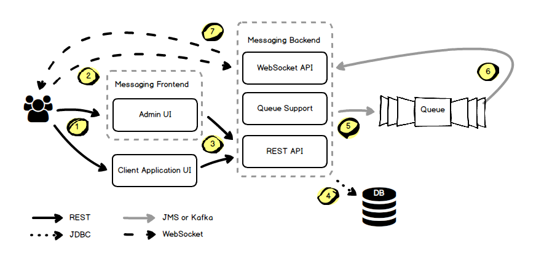

Данный проект представляет собой реализацию сервиса для обмена уведомлениями

Основные функции сервиса:
- оповещение пользователей
  - по электронной почте
  - через web socket
- обмен сообщениями между пользователями

# Требования
- Openjdk 21
- PostgreSQL 14
- Apache Kafka 2.6

# Стек технологий
- Java 21
- JDBC
- JMS
- Spring Boot 3.5.3
- Jooq 3
- Liquibase 4.24
- N2O Platform 7.0.1
- N2O UI Framework 7.29.1
- Websockets

# Структура проекта
Документация:
- `doc` - Документация проекта

UI:
- `messaging-admin-frontend` - Запускаемый модуль UI для администрирования уведомлений (включает messaging-admin-web)
- `messaging-admin-web` - UI для администрирования уведомлений (включает messaging-web)
- `messaging-web` - UI для встраивания пользовательских настроек и ленты уведомлений

Backend:
- `messaging-backend` - Запускаемый модуль бэкенда
- `messaging-api` - REST интерфейсы и модели отправки данных
- `messaging-impl` - REST сервис уведомлений + скрипты БД

Брокер сообщений:
- `messaging-support-kafka` - Модуль для поддержки работы уведомлений через Kafka
  
Каналы отправки:
- `messaging-channel-api`- API каналов отправки уведомлений
- `messaging-email-channel` - Модуль отправки уведомлений по электронной почте
- `messaging-web-channel` - Модуль отправки уведомлений через web socket

# Общая схема взаимодействия компонентов

**Шаги:**
1. Пользователь открывает в браузере страницу приложения или страницу администрирования модуля уведомлений.
2. Браузер устанавливает соединение с WebSocket API сервиса уведомлений.
3. Приложение инициирует отправку уведомлений через REST API сервиса уведомлений.
4. Уведомление сохраняется в базу данных.
5. Уведомление отправляется в topic получателя механизма очередей.
6. Topic subscriber получателя забирает уведомление.
7. Уведомление отправляется получателю через WebSocket-соединение.

# Документация
Подробнее см. [документацию](doc/Index.md)
